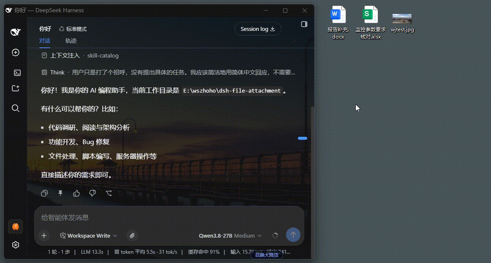
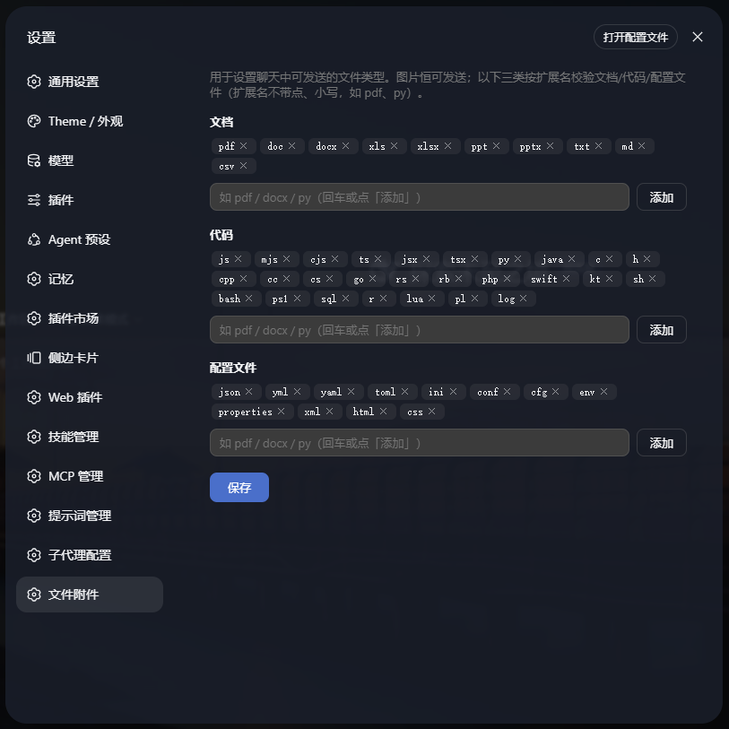

# dsh-file-attachment

DeepSeek Harness (dsh) web GUI 插件：在会话输入框中**拖入或 Ctrl+V 粘贴文档（支持多文件，一次可拖入/粘贴多个文件）**时，浏览器端批量读取全文，保存到**当前会话工作区根目录下的 `.dsh-file-attachment/`**，并在输入框光标处插入 `@<保存副本绝对路径>` 引用。agent 读取 `@路径` 时直接读到落盘副本，不再依赖原始文件位置。

图片文件由插件接管后走 dsh web 既有草稿图片流程（`addImages`）：不落盘、不进文件条、不缩放；仅当输入框未就绪且为纯图片时，才原样交回原生。

另外，输入框工具栏（加号之后）提供了一个**上传按钮（📎 回形针图标）**，点击后弹出系统文件选择框，可多选文档/图片，复用与拖入/粘贴完全一致的落盘 + `@路径` 插入管线。PC 与移动端浏览器均适用（移动端走原生文件选择器）。

## 界面

**演示**：拖入/粘贴文档 → 落盘并在输入框插入 `@` 引用 → 输入框上方 dock 文件条待发送状态（完整流程见 gif）。



**上传按钮**：输入框工具栏 `+` 之后的 📎 回形针图标，点击弹出系统文件选择框（可多选文档/图片）。

**可上传类型设置**：「设置 → 文件附件」页可按 文档 / 代码 / 配置文件 三类增删扩展名（小写、不带点），图片恒可发送。



## 行为一览

| 操作 | 行为 |
| --- | --- |
| 点击**上传按钮（📎）**，在系统文件选择框中**多选**文档/图片 | 与拖入/粘贴同一管线：文档 → 落盘 + 光标插入全部 `@` 路径；图片 → 走既有草稿图片流程；`accept` 限定图片 + 常见文档扩展名，移动端自动弹出文件选择器 |
| 拖入/粘贴 **文档/代码/配置文件**（非图片，默认 doc·code·config 三类扩展名，如 docx/xlsx/pdf/md/txt/js/json） | 浏览器读全文 → base64 → 宿主落盘 `<会话工作区>/.dsh-file-attachment/<日期>/<文件名>` → 光标插入 `@绝对路径`，成功不提示、失败简短 toast |
| 一次拖入/粘贴 **多个文件**（支持多文件） | 批量处理：逐个读取全文 → base64 → 落盘 → 在光标处一次性插入全部 `@` 引用；全部成功不提示，部分失败仅简短提示「N 个已跳过」 |
| 拖入 **目录** | 拒绝，toast 提示「不支持拖入目录」，不插入引用 |
| 拖入/粘贴 **图片** | 接管后走 dsh 既有草稿图片流程（`addImages`）：不落盘、不进文件条、不缩放；输入框未就绪且纯图片时原样交原生 |
| 粘贴 **纯文本**（含从地址栏复制的目录路径字符串） | 不改写，完全原生行为 |
| 重复拖入同名文件（同一天内） | 追加 `-1`、`-2` 序号，绝不覆盖 |
| 点文件条（dock）`×` 移除 | 移除 dock 条目，并清除输入框中指向该文件路径的**全部** `@` 引用 chip（同一文件拖入多次产生的多个 chip 一并清除）；其他文件的引用不受影响 |
| 单文件 > 50MB | 跳过并提示 |

### 文件命名

日期作为**子目录名**，文件保留原始文件名：`.dsh-file-attachment/<日期>/<清洗后文件名>`，例如 `.dsh-file-attachment/2026-02-11/说明.docx`；日期格式 `YYYY-MM-DD`（ISO 日期前 10 位，各平台安全且可排序）。同一天内同名冲突在扩展名前追加 `-N`。

### 项目根解析

保存目录的根 = **当前会话工作区**（`session.header.cwd`），回退顺序：会话 cwd → `sandboxPolicy.workspaceRoot` → `process.cwd()`。每个项目（工作区）都各自维护自己的 `.dsh-file-attachment/` 目录。

### 跨平台

- 保存路径用 Node `path.join`（平台分隔符自适应）
- 时间戳/文件名清洗同时对 Windows 与 POSIX 命名规则安全
- Host 半直接 `node:fs/promises` 写字节，无 shell 依赖

## 安装（官方 `dsh plugin` 方式）

本仓库是一个标准 dsh 插件包（声明了 `dsh.bundle.patch`），并已发布为 npm 包 `@wszhoho/dsh-file-attachment`。用官方 CLI 安装，pnpm 会自动处理依赖、并把本包加入 profile 的 `dsh.profile.bundles` 层。`dsh plugin add` 的参数会转发给 profile 目录的 pnpm 执行，三种来源任选其一：

### 从 npm 安装（普通用户推荐）

```powershell
dsh plugin --profile web add @wszhoho/dsh-file-attachment
# 重启 web GUI：dsh web（或从托盘重启）
```

### 本地源码安装（开发用，边改边验）

```powershell
# 在仓库父目录执行（<parent> 换成放置仓库的实际目录）
cd <parent>
dsh plugin --profile web add ./dsh-file-attachment
# ./dsh-file-attachment 相对路径等价 pnpm link；改完 lib/*.js 后重启 dsh web 即生效
```

### 从 GitHub 安装

```powershell
dsh plugin --profile web add github:wszhoho/dsh-file-attachment
```

- 无论哪种来源，安装后都自动进入 `dsh.profile.bundles`，无需手改 profile `package.json`；
- 升级：`dsh plugin --profile web update dsh-file-attachment`。

## 架构

```
packages/dsh-file-attachment/
├── package.json          # dsh.client 声明 + bundle patch 指向
├── cordis.patch.yml      # bundle 补丁：插入本插件行
└── lib/
    ├── index.js          # Host 半：webServer 路由（POST /dsh-file-attachment/save），node:fs/promises 写盘
    └── client.js         # Client 半：document 级 capture drop/paste/dragenter 监听 + 槽组件
```

- **Host 半**：`webServer.register` 前缀路由 `/dsh-file-attachment`，POST `/dsh-file-attachment/save` 接收 `{name, data(base64), sessionId}`，base64 解码后用 `node:fs/promises` 写盘到会话工作区 `.dsh-file-attachment/`，返回 `{ok, value:{path,dir,name,size}}`。
- **Client 半**：`conversation.input.dock`（list 槽，同步桥状态，不渲染文本；经会话作用域取输入机，hero 首轮空白态也挂载）+ `shell.overlay`（list 槽，toast 通知展示）+ `conversation.input.left`（list 槽，**上传按钮**，渲染为左动作簇第 3 项），document 级 capture 监听先于应用 bubble 监听执行。
- **上传按钮**：`FaUploadButton` 组件注入 `conversation.input.left`（`order:10`），内部是隐藏 `<input type="file" multiple accept>`（`accept` 限定 `image/*` + 常见文档扩展名），点击触发原生选择框；`onChange` 按 `file.type` 是否为 `image/` 分派到 `runBatch`（文档落盘插 `@`、图片走草稿图片流程），完成后清空 `input.value` 以便重复选择同一文件。图标为内联 SVG 回形针（📎，`stroke=currentColor`，随主题变色）。
- **通知**：`shell.overlay` frame-wide 浮动 toast（不参与文档流，不破坏布局），4 秒自动消失。
- **浮层**：拖入任何文件时 capture 阶段拦截应用自带「拖入图片…」DropOverlay（文案面向图片，对文档是误导）。

## 开发说明

- `lib/*.js`、`package.json`、`cordis.patch.yml`、`README.md` 当前均为 **UTF-8 无 BOM**（以仓库实测为准）；编辑时保持原编码，不引入 BOM。
- Host 半用 `webServer.register({ kind: 'prefix', path: '/dsh-file-attachment', handler })` 收文件，纯 ESM 无构建，不依赖装饰器/远程反射。
- Client 半保存用 `fetch('/dsh-file-attachment/save', { method: 'POST', body: JSON.stringify({ name, data, sessionId }) })`，信封为 `{ ok, value | error }`。
- 项目根 = 会话工作区（`session.header.cwd` → `sandboxPolicy.workspaceRoot` → `process.cwd()` 兜底）。
- 50MB 上限两侧一致（client 跳过 + host 校验）。

## Star

如果这个插件帮到了你，欢迎到 [GitHub 仓库](https://github.com/wszhoho/dsh-file-attachment) 点个 ⭐ Star，感谢支持！

## License

MIT