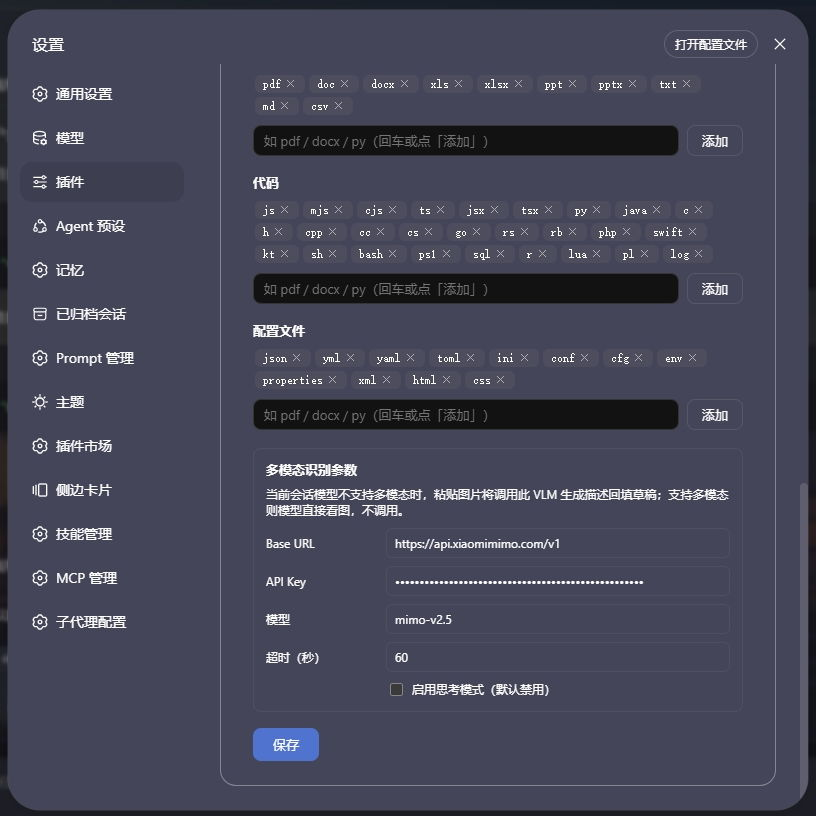

# dsh-file-attachment

DeepSeek Harness (dsh) web GUI 插件：在会话输入框中拖入或 Ctrl+V 粘贴文档/图片，或通过DSH本体 📎 附件按钮上传（插件已接管本体上传按钮），图片调用配置好的vlm模型自动进行图片识别。

图片与文档走**同一条落盘管线**：图片在输入框**内联附件条**中以缩略图预览（点击放大），在聊天区渲染为**可点击放大的缩略图**；文档在附件条中以类型图标 + 文件名条目显示，在聊天区保持芯片样式。当前会话模型不支持多模态时，图片自动调用**可配置 VLM** 识别生成中文描述回填草稿，文本模型也能「看懂」图片。

插件接管 dsh 原生 **📎 附件上传按钮**（hero / composer 两种输入模式共用同一位置：加号右侧、modes 左侧），点击后弹出系统文件选择框，可多选文档/图片，复用与拖入/粘贴完全一致的落盘 + `@路径` 插入管线。PC 与移动端浏览器均适用（移动端走原生文件选择器）。

## 界面

**演示**：拖入/粘贴文档或图片 → 落盘并在输入框插入 `@` 引用 → 输入框内联附件条待发送状态（完整流程见 gif）。


**内联附件条**：上传后在 composer 卡片内部、编辑区上方显示——图片为缩略图（点击放大），文档为类型图标 + 文件名条目；条目可移除（同步清除草稿中对应 `@引用`），发送后自动清空。

**聊天区图片缩略图**：历史对话中用户消息里的 `@图片路径` 渲染为缩略图（点击打开 Lightbox 放大层）；`@文件路径` 保持芯片样式。

**上传按钮**：接管 dsh 原生 📎 附件按钮（加号右侧、modes 左侧），点击弹出系统文件选择框（可多选文档/图片）。

**设置页**：「设置 → 文件附件」页两部分：

- **可上传类型**：按 文档 / 代码 / 配置文件 三类增删扩展名（小写、不带点），图片恒可发送；
- **多模态识别参数（VLM）**：Base URL / API Key / 模型 / 思考模式开关（默认禁用）/ 超时时间（默认 60 秒），仅当前会话模型不支持多模态时调用，未填 API Key 时静默跳过。



## 行为一览

| 操作 | 行为 |
| --- | --- |
| 点击 **📎 附件按钮**（插件接管 dsh 原生按钮），在系统文件选择框中**多选**文档/图片 | 与拖入/粘贴同一管线：图片与文档统一落盘 + 光标插入全部 `@` 引用；移动端自动弹出文件选择器 |
| 拖入/粘贴 **文档/代码/配置文件**（默认 doc·code·config 三类扩展名，如 docx/xlsx/pdf/md/txt/js/json） | 浏览器读全文 → base64 → 宿主落盘 `<会话工作区>/.dsh-file-attachment/<日期>/<文件名>` → 光标插入 `@绝对路径` chip，成功不提示、失败简短 toast |
| 一次拖入/粘贴 **多个文件**（支持多文件） | 批量处理：逐个读取全文 → base64 → 落盘 → 在光标处一次性插入全部 `@` 引用；全部成功不提示，部分失败仅简短提示「N 个已跳过」 |
| 拖入/粘贴 **图片** | 与文档同一落盘管线：插入 `@绝对路径` 引用 + 附件条登记缩略图；聊天区渲染为可点击放大的缩略图 |
| 图片需要被理解，而当前模型**不支持多模态** | 粘贴/上传图片时自动调用可配置 VLM（OpenAI 兼容 `chat/completions`）生成中文描述回填草稿（仅注入模型上下文，不进对话界面）；agent 也可主动调用 `describe_image` 工具识别已落盘图片（含历史消息中的 `@图片` 引用） |
| 拖入 **目录** | 拒绝，toast 提示「不支持拖入目录」，不插入引用 |
| 粘贴 **纯文本**（含从地址栏复制的目录路径字符串） | 不改写，完全原生行为 |
| 重复拖入同名文件（同一天内） | 追加 `-1`、`-2` 序号，绝不覆盖 |
| 点附件条 `×` 移除 | 移除附件条目，并清除输入框中指向该文件路径的**全部** `@` 引用 chip（同一文件上传多次产生的多个 chip 一并清除）；其他文件的引用不受影响 |
| 单文件 > 50MB | 跳过并提示 |

### 文件命名

日期作为**子目录名**，文件保留原始文件名：`.dsh-file-attachment/<日期>/<清洗后文件名>`，例如 `.dsh-file-attachment/2026-02-11/说明.docx`；日期格式 `YYYY-MM-DD`（ISO 日期前 10 位，各平台安全且可排序）。同一天内同名冲突在扩展名前追加 `-N`。

### 项目根解析

保存目录的根 = **当前会话工作区**（`session.header.cwd`），回退顺序：会话 cwd → `sandboxPolicy.workspaceRoot` → `process.cwd()`。每个项目（工作区）都各自维护自己的 `.dsh-file-attachment/` 目录。

### 跨平台

- 保存路径用 Node `path.join`（平台分隔符自适应）
- 时间戳/文件名清洗同时对 Windows 与 POSIX 命名规则安全
- Host 半直接 `node:fs/promises` 写字节，无 shell 依赖

## 安装（官方 `dsh plugin` 方式）

本仓库是一个标准 dsh 插件包（声明了 `dsh.bundle.patch`），并已发布为 npm 包 `@wszhoho/dsh-file-attachment`。用官方 CLI 安装，pnpm 会自动处理依赖、并把本包加入 profile 的 `dsh.profile.bundles` 层。`dsh plugin add` 的参数会转发给 profile 目录的 pnpm 执行，三种来源任选其一：

### 从 npm 安装（普通用户推荐）

```powershell
dsh plugin --profile web add @wszhoho/dsh-file-attachment
# 重启 web GUI：dsh web（或从托盘重启）
```

### 本地源码安装（开发用，边改边验）

```powershell
# 在仓库父目录执行（<parent> 换成放置仓库的实际目录）
cd <parent>
dsh plugin --profile web add ./dsh-file-attachment
# ./dsh-file-attachment 相对路径等价 pnpm link；改完 lib/*.js 后重启 dsh web 即生效
```

### 从 GitHub 安装

```powershell
dsh plugin --profile web add github:wszhoho/dsh-file-attachment
```

- 无论哪种来源，安装后都自动进入 `dsh.profile.bundles`，无需手改 profile `package.json`；
- 升级：`dsh plugin --profile web update dsh-file-attachment`。

## 架构

```
packages/dsh-file-attachment/
├── package.json          # dsh.client 声明 + bundle patch 指向
├── cordis.patch.yml      # bundle 补丁：插入本插件行
└── lib/
    ├── index.js          # Host 半：webServer 路由（/save /config /describe）+ describe_image 工具
    └── client.js         # Client 半：document 级 capture drop/paste 监听 + 📎 按钮接管 + 槽组件
```

- **Host 半**：`webServer.register` 前缀路由 `/dsh-file-attachment`：
  - POST `/save`：接收 `{name, data(base64), sessionId}`，base64 解码后用 `node:fs/promises` 写盘到会话工作区 `.dsh-file-attachment/`，返回 `{ok, value:{path,dir,name,size}}`；
  - GET/POST `/config`：读写插件配置（可上传类型 + VLM 参数）；
  - POST `/describe`：接收 `{dataUrl, prompt}`，调 VLM（OpenAI 兼容 `chat/completions`）识别图片，返回中文描述与当前思考模式配置（`thinkingType`）；
  - `describe_image` 工具（Host 注册）：agent 需要理解 `@图片` 引用时调用——读已落盘图片 → VLM 识别 → 描述直接作为工具输出返回（UI 展示 + 模型可见）。
- **Client 半**槽位：
  - `conversation.input.attachments`（shadow 原生附件条，priority -100）：**内联附件条**，渲染自维护的附件登记表——图片为 data URL 缩略图（点击放大）、文档为类型图标 + 文件名；条目可移除（同步清除草稿 `@引用`），发送后自动清空，不依赖 dsh 附件草稿链路（文本模型可正常发送）；
  - `conversation.chat.node` keyed `user`（shadow 原生用户消息渲染器，priority -100）：聊天区 `@图片路径` 渲染为缩略图（经宿主 `/api/file?path=` 读取落盘图片，点击打开 Lightbox 放大层），`@文件路径` 保持芯片样式；原生 image/file 附件块（多模态模型场景）仍交 dsh 渲染；
  - `conversation.input.dock`：仅保留 `FaBridge` 桥槽（经会话作用域同步 shell/actions/input 状态，hero 首轮空白态也挂载），原文件条渲染已移除；
  - `shell.overlay`（list 槽，toast 通知展示）。
  - **📎 按钮接管**：capture 阶段拦截原生 `fileInput` 的 change 事件，文件进入插件自定义管线（图片/文档统一落盘 + 插 `@引用`）；纯文本粘贴完全原生，不做改写。document 级 capture 监听先于应用 bubble 监听执行。
- **通知**：`shell.overlay` frame-wide 浮动 toast（不参与文档流，不破坏布局），4 秒自动消失。
- **浮层**：拖入任何文件时 capture 阶段拦截应用自带「拖入图片…」DropOverlay（文案面向图片，对文档是误导）。

## 开发说明

- `lib/*.js`、`package.json`、`cordis.patch.yml`、`README.md` 当前均为 **UTF-8 无 BOM**（以仓库实测为准）；编辑时保持原编码，不引入 BOM。
- Host 半用 `webServer.register({ kind: 'prefix', path: '/dsh-file-attachment', handler })` 提供 `/save`、`/config`、`/describe` 三个路由，并经 `tools.register` 注册 `describe_image` 工具；纯 ESM 无构建，不依赖装饰器/远程反射。
- Client 半保存用 `fetch('/dsh-file-attachment/save', { method: 'POST', body: JSON.stringify({ name, data, sessionId }) })`，信封为 `{ ok, value | error }`。
- VLM 走 OpenAI 兼容 `chat/completions`（Base URL / API Key / 模型 / 思考模式 / 超时时间可在设置页配置，思考模式默认关闭，超时默认 60 秒）；请求按 MiMo 官方格式发送 `thinking: { type: "enabled"|"disabled" }`（扁平 `thinkingType` 会被 API 忽略，而 mimo-v2.5 默认开启深度思考，导致识别极慢——实测 206 秒 vs 关闭后 22~73 秒，服务延迟波动较大，若偶发超时可调大）；超时后工具调用中止并明确报错「VLM 请求超时（N 秒）」，不再挂死会话；`describe_image` 工具输出 JSON 附带 `thinkingType`（enabled/disabled），直观展示当前思考模式配置。未填 API Key 时识别静默跳过，不影响落盘。
- 项目根 = 会话工作区（`session.header.cwd` → `sandboxPolicy.workspaceRoot` → `process.cwd()` 兜底）。
- 50MB 上限两侧一致（client 跳过 + host 校验）。

## Star

如果这个插件帮到了你，欢迎到 [GitHub 仓库](https://github.com/wszhoho/dsh-file-attachment) 点个 ⭐ Star，感谢支持！

## License

MIT
